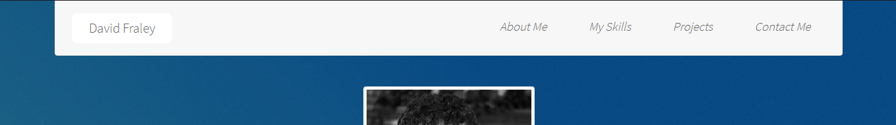
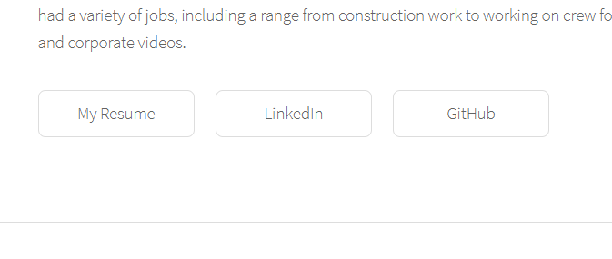
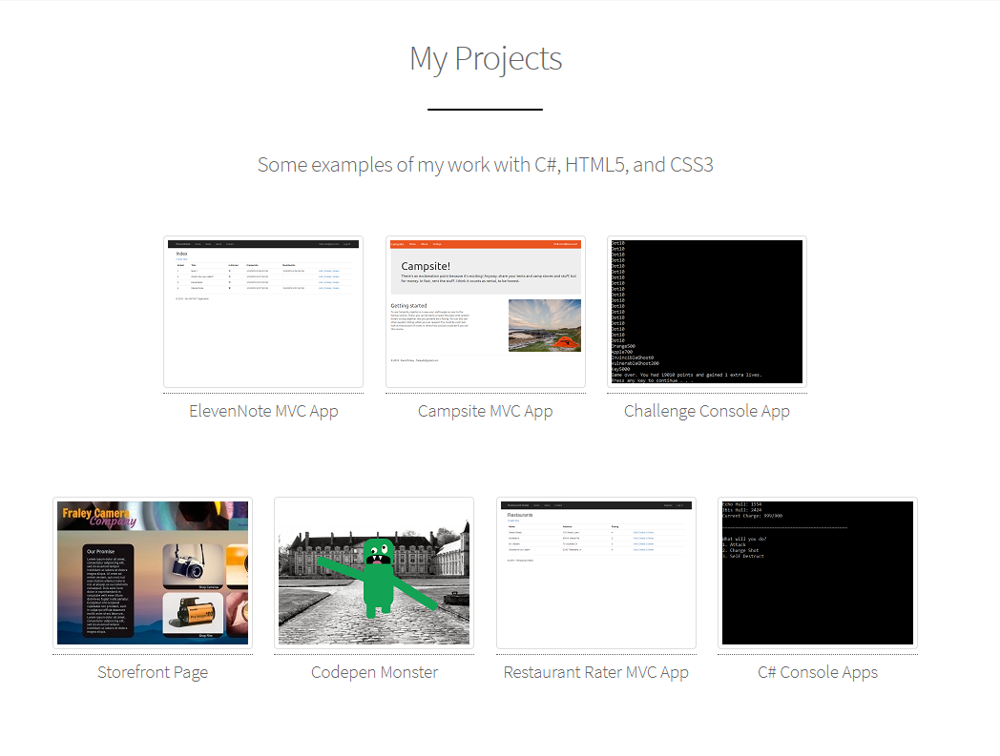
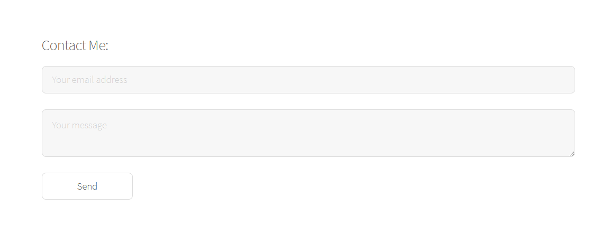

# David Fraley's Portfolio

## Purpose
This site works as a portfolio to promote the creator, David Fraley, as a Junior Web Developer.

## Running the webpage
The portfolio is deployed at https://fraleyds.github.io/fraleyds/, requiring nothing else to run it aside from following the link.

## How to use
The site is divided into sections for About Me, skills, projects, and contacting me. Any section can be reached by scrolling,
or by clicking the name of the desired section in the nav bar:

Clicking "David Fraley" will return the user to the top of the page.

## External links
The "About Me" section contains links to my resume, LinkedIn, and Github profile, as shown:

The "My Projects" section contains links to various projects I've completed:

Additionally, the "Contact Me" section uses Formspree to allow anyone to send me messages through their service:

## Contact the developer
You can either go through the portfolio to contact me, or email me at fraleyds@gmail.com